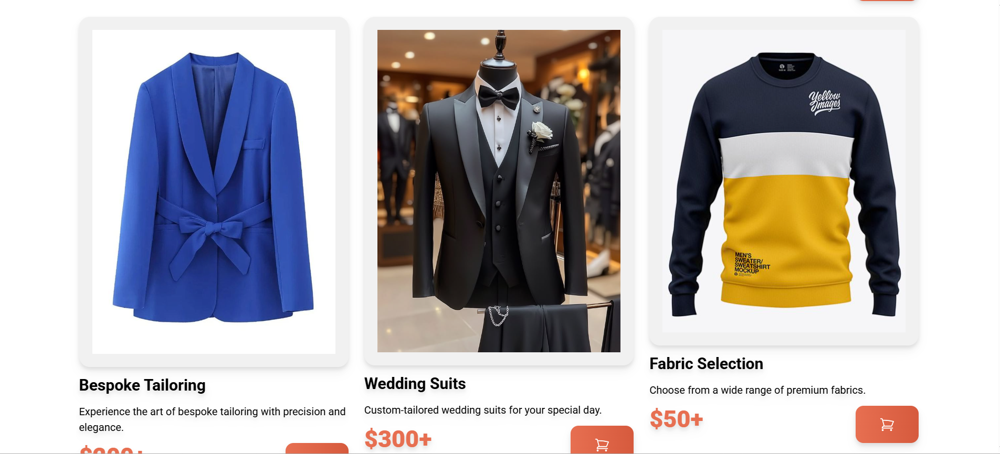

# ✂️ Tailor Service Landing Page

A simple and responsive landing page for a tailor service built with **HTML**, **Tailwind CSS**, and **DaisyUI**. Clean design, minimal code, and fully responsive layout!

## 🧰 Built With

- 🌐 **HTML**
- 🎨 **Tailwind CSS**
- 💠 **DaisyUI** (Tailwind CSS Component Library)

## 🚀 Features

- Responsive layout for all devices
- Beautiful component styling using DaisyUI
- Service section to showcase offerings
- Clean footer with contact info and links

---

## 📸 Screenshots

### 🧷 Services Section

> Displays all available tailoring services in an organized layout using DaisyUI cards.

### 🧵 Service 1

> Highlights a specific tailoring service with an image and short description to draw attention.

### 👣 Footer

> Footer includes contact info, social media icons, and quick links to other sections.

---

## 🛠️ How to Use

1. **Clone the repository:**
   ```bash
   git clone https://github.com/mahiamOmO/tailor-service-landing-page.git

    cd tailor-service-landing-page
    ```

## HAPPY CODING! 😊
